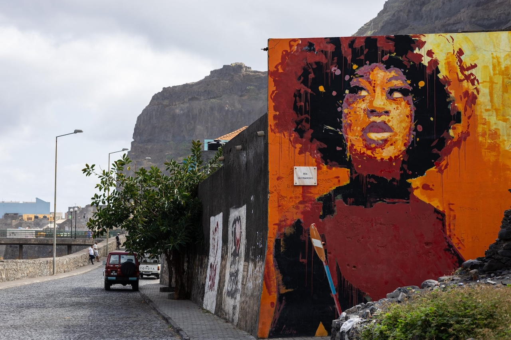

Hello!

I'm a researcher in computer vision and deep learning and I'm currently working with [Federico Tombari](https://federicotombari.github.io/) at Google Zurich where I lead a small team of researchers dealing with fundamental research as well as research to production transformation. 
Previously I was enrolled as a post doc at the [Computer Vision Lab](https://www.vision.deis.unibo.it/) of the university of Bologna under the supervision of Professor [Luigi Di Stefano](https://scholar.google.ch/citations?user=xZVTzyAAAAAJ&hl=de).

I received my PhD in Computer Science and Engineering from University of Bologna on April 2019. 
During my PhD I have worked on deep learning solutions for product detection and recognition in retail environments and on deep learning applied to depth estimation from stereo and monocular cameras.

I am currently working on multimodal learning, generative models for images (and more) and complex text understanding tasks. 
If you are interested in working with me feel free to reach out!

P.S.: I also like to take photos, besides working with them, check [my seldomly updated Flickr](https://www.flickr.com/photos/196993770@N03/)

## News

__2025__:
  * [LIME](publication/LIME) will be presented as oral presentation at WACV2025! Congratulation to [Enis](https://enisimsar.github.io/) for the great achievement!

## Bonus Pic & Song 
| [Soundtrack](https://www.youtube.com/watch?v=PS9Bc_GQBEs) |

## Older News

__2024__:
  * 2 new papers uploaded to Arxive: [UIP2P](publication/UIP2P) showing how to train image editing models without supervision and [ACED](publication/ACED) unveiling a correlation between data curation and knowledge distillation and a better way to train small multimodal models. 
  * 2 papers on building better VLM accepted at ECCV24! Check [TCR](publication/TCR) and [BRAVE](publication/Brave) and a huge thanks to my awesome co-authors [Bruno](https://www.kor.bar/) and [Oguzhan](https://ofkar.github.io/).
  * Our [TouchSDF paper](/publication/TouchSDF) has been accepted for publication in RAL! Check also the follow up work we just uploaded to Arxiv where we integrate touch with a gaussian splatting reconstruction pipeline [SnapTapSplat](publication/SnapTapSplat).
  * Check our latest work on interfacing LLM with multiple visual encoder to have a broader view on the visual world: [BRAVE](publication/Brave).
  * Exciting new works uploaded to Arxiv: [Lime](publication/LIME) for image editing, [InseRF](publication/InseRF) for NeRF Editing, [Text Conditioned Resamppler](publication/TCR) for interfacing LLM to videos. 

__2023__:
  * Our [TextMesh](/publication/TextMesh) work has been accepted to 3DV!
  * Our works [NeRF-GAN Distillation](publication/NerfGanDistillation) and [LatentSwap3D](publication/LS3D) have been presented at the [ICCV AI3DCC 2023 workshop](https://ai3dcc.github.io/). 
  * Have you ever wondered what "A squirrel-octpus hybrid" would look like in 3D? Come check out our [text to mesh generation model](/publication/TextMesh) in our [project page](https://fabi92.github.io/textmesh/).
  * Our work [NeRF-supervised Deep Stereo](/publication/NerfStereo) has been accepted at CVPR 2023, see you in Vancouver!
  * In [NeRF-GAN Distillation](publication/NerfGanDistillation) we show how NeRF volumetric rendering can sucesfully be approximated with plain convolutions for generative models.
  * [AT/DT++](publication/ATDT2) has been accepted for publication on TPAMI.

__2022__:
  * We have uploaded to Arxive our latest work that enables editing of 3D aware Nerf based GAN: [LatentSwap3D](publication/LS3D), [code available](https://enisimsar.github.io/latentswap3d/)
  * We have uploaded to Arxive an old work which never made it out of the review process, the idea was simple but effective: making. a CycleGAN parametrizable --> [ParGAN](publication/ParGAN)
  * I was interviewed for the ProfessionAI podcast to share my experience as CV researcher, you can find the interview [here](https://www.youtube.com/watch?v=GfEJxyedtJQ)(italian only :/)
  * I was acknowledged as [**outstanding reviewer at ECCV22**](https://eccv2022.ecva.net/program/outstanding-reviewers/)!
  * [BNE](publication/BNE) has been accepted for publication on Pattern Recognition.

__2021__:

* We uploaded to arxiv our latest work [LegoFormer: Transformers for Block-by-Block Multi-view 3D Reconstruction](publication/LegoFormer) together with an open source implementation for it. 
* I was acknowledged as [**Outstanding Reviewer at CVPR2021**](http://cvpr2021.thecvf.com/node/184), thank you to all the organizers!
* Our [Batch Normalization Embeddings for Deep Domain Generalization](publication/BNE) will be presented during CVPR21 at the [L2ID workshop](https://l2id.github.io/index.html#people) 
* The [extended version](publication/realTimeII) of our CVPR 2019 oral paper has been accepted to TPAMI!
* We uploaded to arxiv our latest work [Unsupervised Novel View Synthesis from a Single Image](publication/NVS).

__2020__:

* We uploaded to arxiv our latest work [Batch Normalization Embeddings for Deep Domain Generalization](publication/BNE).
* I was acknowledged as **Outstanding Reviewer at ACCV2020**, thank you to all the organizers! 
* Our paper [A Divide et Impera Approach for 3D Shape Reconstruction from Multiple Views](publication/DivideEtImpera) has been accepted as oral to 3DV 2020! Here we show how to use deep learning and traditional multi-view geometry wisdom to solve multi view reconstruction in an end to end way. 
* I was awarded as **Outstanding Reviewer at ECCV2020**, thank you to all the organizers!
* Come meet me on the 26th of August at the Virtual Google Booth at ECCV2020 to chat about what is it like to work and do research in Google. From 6:30 to 8:30 pm CEST.
* We just submitted to TPAMI an extended version of our CVPR2019 work on online self-supervision for stereo depth estimation. You can find more details on our newer work [Continual Online Adaptation for Deep Stereo](publication/realTimeII). The online code will be updated soon, stay tuned. 

__2019__:

* Our paper [Unsupervised Domain Adaptation for Depth Prediction from Images](publication/AdaptationJournal) has been accepted for publication on the RGBD special issue of TPAMI. We will release the code soon!
* Our paper [Semi-Automatic Labeling for Deep Learning in Robotics](publication/ARS) has been accepted for publication in the IEEE Transactions on Automation Science and Engineering journal.
* Our paper [Learning Across Tasks and Domains](publication/ATDT) got accepted at ICCV 2019 for a poster presentation! I wish to thank [Pierluigi](https://www.unibo.it/sitoweb/pierluigi.zama) for the wonderful work. Stay tuned for the code release.
* After 3.5 wonderful years at the Computer Vision Lab of Bologna it's time to move on, from July I will start a collaboration with the computer vision team of Federico Tombari at Google Zurich! So long Bologna, and thank you for all the fish!
* My Phd thesis is finally online and provided with open access by UniBO [link](http://amsdottorato.unibo.it/8970/).
* I will be at CVPR 2019 to present our two works on stereo depth estimation: [Real-time self-adaptive deep Stereo (Oral+Poster+Demo)](publication/realTime)  and [Learning To Adapt for Stereo (Poster)](publication/2019-L2A). See you there!
* Me, [__Matteo Poggi__](https://vision.disi.unibo.it/~mpoggi/) and __Oscar Rahnama__ will be on the 22nd of May at BMVA meeting on High-Performance Computing for Computer Vision to present our recent works on efficient depth estimation. See you there!
* We have just released our last work where we show how it is possible to transform deep representation across domains and tasks. I believe it is a really exciting and under developed research field, check it out! [Learning Across Tasks and Domains](publication/ATDT)
* Our last work on Grocery Product Recognition has been published on CVIU, check it out: [Domain invariant hierarchical embedding for grocery products recognition](publication/DIHE).
* Our paper on designing an efficient stereo systems for FPGA has been published on IEEE Transactions on Circuits and Systems II: Express Briefs, check it out: [Real-Time Highly Accurate Dense Depth on a Power Budget using an FPGA-CPU Hybrid SoC](publication/FPGA).
* I have successfully defended my Ph.D. Thesis titled "Computer Vision and Deep Learning for Retail Store Management", thank to Centro Studi for financing my Ph.D and to all my colleagues and friends for helping me during the last three years! 